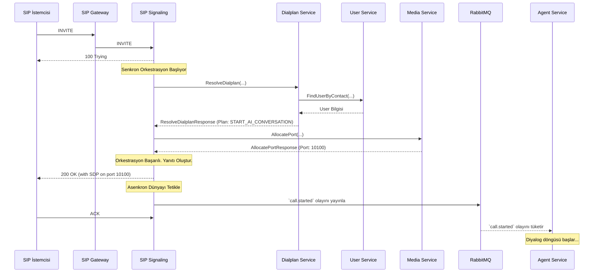

# 🚦 Sentiric SIP Signaling Service - Mantık ve Akış Mimarisi

**Belge Amacı:** Bu doküman, `sip-signaling-service`'in Sentiric platformunun **senkron çağrı kurulum orkestratörü** olarak rolünü, bir SIP çağrısını nasıl hayata geçirdiğini ve platformun senkron dünyası (`gRPC`) ile asenkron dünyası (`RabbitMQ`) arasında nasıl bir köprü kurduğunu açıklar.

---

## 1. Stratejik Rol: "Senkron Orkestra Şefi ve Postacı"

Bu servisin iki temel görevi vardır:
1.  **Orkestra Şefi (Çağrı Kurulumunda):** Dış dünyadan gelen bir çağrı (`INVITE`) isteğini alıp, bu çağrının canlıya geçmesi için gereken tüm adımları **anlık ve sıralı** olarak yönetir. `dialplan`, `user` ve `media` servislerini bir orkestra şefi gibi yöneterek çağrıyı kurar.
2.  **Postacı (Çağrı Kurulduktan Sonra):** Çağrı başarıyla kurulduğunda, görevi platformun asenkron beyni olan `agent-service`'e devreder. Bunu, `call.started` olayını içeren bir mektubu `RabbitMQ` posta kutusuna atarak yapar. Aynı şekilde, çağrı bittiğinde de `call.ended` mektubunu atar.

**Bu servis sayesinde:**
*   **Hızlı Yanıt Verilir:** Bir arayan, telefonunun çalması için saniyelerce beklemek istemez. Bu servis, Rust'ın hızı ve senkron gRPC çağrıları ile anında bir yanıt (`200 OK`) üreterek kullanıcı deneyimini iyileştirir.
*   **Sorumluluklar Ayrışır:** Uzun ve karmaşık AI diyalog mantığı bu servisi meşgul etmez. Görevi, çağrıyı kurup hemen `agent-service`'e devretmektir.
*   **Dayanıklılık Sağlanır:** Eğer çağrı kurulum adımlarından herhangi biri (`dialplan`'e ulaşılamaması gibi) başarısız olursa, çağrı hiç başlamadan sonlandırılır ve `agent-service` gibi asenkron servisler gereksiz yere meşgul edilmez.

---

## 2. Uçtan Uca Akış: Bir `INVITE` İsteğinin Yaşam Döngüsü

