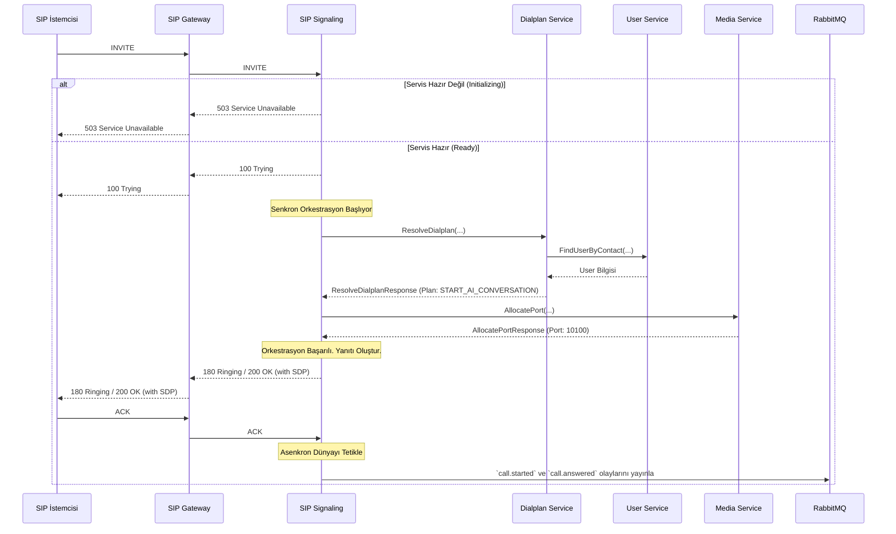

# 🚦 Sentiric SIP Signaling Service - Mantık ve Akış Mimarisi

**Belge Amacı:** Bu doküman, `sip-signaling-service`'in Sentiric platformunun **dayanıklı çağrı kurulum orkestratörü** olarak rolünü, bir SIP çağrısını nasıl hayata geçirdiğini ve platformun senkron dünyası (`gRPC`) ile asenkron dünyası (`RabbitMQ`) arasında nasıl bir köprü kurduğunu açıklar.

---

## 1. Stratejik Rol: "Dayanıklı Orkestra Şefi"

Bu servis, gelen bir SIP çağrısını hayata geçirmek için gereken tüm adımları yöneten merkezi bir beyindir. Ancak görevi bundan daha fazlasıdır; sistemin geri kalanı henüz hazır olmasa bile dış dünyaya karşı **profesyonel ve öngörülebilir** bir duruş sergiler.

1.  **Hava Trafik Kontrolörü (Servis Başlarken):** Servis, başlar başlamaz SIP portunu dinlemeye alır. Ancak arka planda kritik bağımlılıklarının (gRPC servisleri, Redis) hazır olmasını bekler. Bu bekleme süresi boyunca gelen çağrıları (`INVITE`) yanıtsız bırakmaz; bunun yerine anında bir **`503 Service Unavailable`** yanıtı ile "kule henüz tam operasyonel değil, lütfen bekleme paternine girin" mesajı verir. Bu, telekom dünyasının "asla yanıtsız bırakma" ilkesini karşılar.

2.  **Orkestra Şefi (Servis Tam İşlevselken):** Tüm bağımlılıklar hazır olduğunda, servis "tam işlevsel" moda geçer. Artık gelen bir `INVITE` isteğini alıp, bu çağrının canlıya geçmesi için gereken tüm adımları **anlık ve sıralı** olarak yönetir. `dialplan`, `user` ve `media` servislerini bir orkestra şefi gibi yöneterek çağrıyı kurar.

3.  **Postacı (Çağrı Kurulduktan Sonra):** Çağrı başarıyla kurulduğunda, görevi platformun asenkron beyni olan `agent-service`'e devreder. Bunu, `call.started` olayını içeren bir mektubu `RabbitMQ` posta kutusuna atarak yapar. Aynı şekilde, çağrı bittiğinde de `call.ended` mektubunu atar.

---

## 2. Uçtan Uca Akış: Bir `INVITE` İsteğinin Yaşam Döngüsü

Aşağıdaki diyagram, servisin iki temel durumundaki davranışını gösterir.

