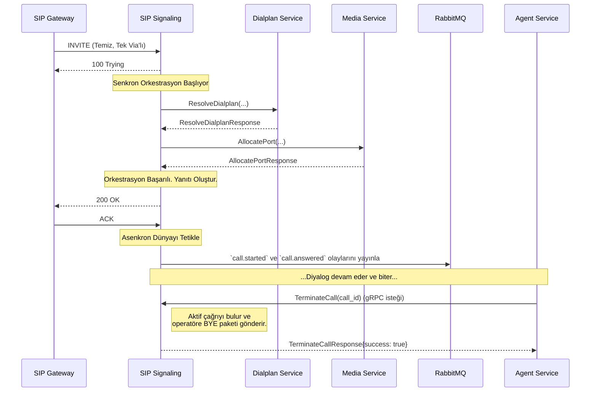

# 🚦 Sentiric SIP Signaling Service - Mantık ve Akış Mimarisi

**Belge Amacı:** Bu doküman, `sip-signaling-service`'in Sentiric platformunun **"İçişleri Bakanı"** olarak rolünü, bir SIP çağrısını hayata geçirmek için platform içindeki diğer servisleri nasıl orkestra ettiğini ve asenkron dünya ile nasıl köprü kurduğunu açıklar.

---

## 1. Stratejik Rol: "Senkron Çağrı Kurulum Orkestratörü"

Bu servis, **yalnızca ve sadece** `sip-gateway-service`'ten gelen temiz, basit ve güvenli SIP isteklerini işler. Dış dünyanın karmaşık ağ ve protokol sorunlarından (NAT, çoklu `Via` başlıkları, standart dışı parametreler) tamamen soyutlanmıştır.

Temel görevleri şunlardır:
1.  Gelen temiz bir `INVITE` isteğini alıp, bu çağrının canlıya geçmesi için gereken tüm adımları **anlık ve sıralı** olarak yönetmek.
2.  `dialplan`, `user` ve `media` servislerini bir orkestra şefi gibi yöneterek çağrıyı kurmak.
3.  `agent-service`'ten gelen **senkron gRPC `TerminateCall`** isteğiyle çağrıyı kontrollü bir şekilde sonlandırmak.

## 2. Uçtan Uca Akış: Bir `INVITE` İsteğinin Yaşam Döngüsü

Aşağıdaki diyagram, servisin bir `INVITE` aldıktan sonraki adımlarını ve `agent-service` ile olan sonlandırma etkileşimini gösterir.

