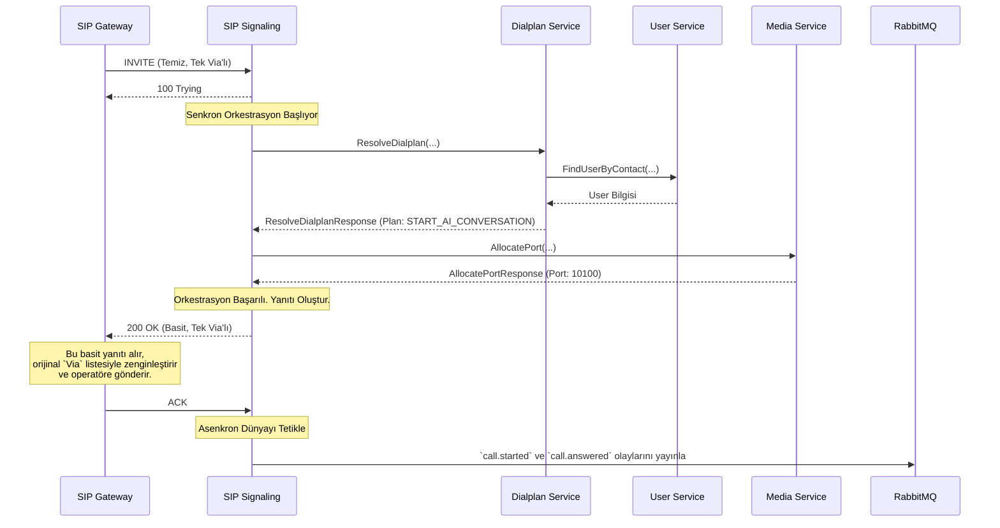

# 🚦 Sentiric SIP Signaling Service - Mantık ve Akış Mimarisi

**Belge Amacı:** Bu doküman, `sip-signaling-service`'in Sentiric platformunun **"İçişleri Bakanı"** olarak rolünü, bir SIP çağrısını hayata geçirmek için platform içindeki diğer servisleri nasıl orkestra ettiğini ve asenkron dünya ile nasıl köprü kurduğunu açıklar.

---

## 1. Stratejik Rol: "İç Orkestra Şefi"

Bu servis, **yalnızca ve sadece** `sip-gateway-service`'ten gelen temiz, basit ve güvenli SIP isteklerini işler. Dış dünyanın karmaşık ağ ve protokol sorunlarından (NAT, çoklu `Via` başlıkları, standart dışı parametreler) tamamen soyutlanmıştır.

Tek görevi, gelen temiz bir `INVITE` isteğini alıp, bu çağrının canlıya geçmesi için gereken tüm adımları **anlık ve sıralı** olarak yönetmektir. `dialplan`, `user` ve `media` servislerini bir orkestra şefi gibi yöneterek çağrıyı kurar.

## 2. Uçtan Uca Akış: Bir `INVITE` İsteğinin Yaşam Döngüsü

Aşağıdaki diyagram, servisin `sip-gateway` tarafından basitleştirilmiş bir `INVITE` aldıktan sonraki adımlarını gösterir.

## 3. Mimari Temelleri ve Kararlar

### 3.1. Sorumlulukların Ayrıştırılması (`Strateji B+`)

*   **Problem:** Önceki mimaride, hem `gateway` hem de `signaling` servisleri, operatör uyumluluğu için karmaşık SIP başlıklarını (örn: `Via`, `Record-Route`) yönetmeye çalışıyordu. Bu, kod tekrarına, bakım zorluğuna ve tutarsızlıklara yol açıyordu.
*   **Karar:** Tüm dış dünya SIP karmaşıklığı yönetimi sorumluluğu **tek bir noktaya, `sip-gateway`'e** verildi. `sip-signaling-service` artık bu detaylarla ilgilenmez.
*   **Sonuç:** `signaling-service`'in kod tabanı önemli ölçüde basitleşti, daha okunabilir ve test edilebilir hale geldi. Servis artık sadece kendi ana görevi olan iç orkestrasyona odaklanıyor.

### 3.2. Dayanıklı ve Durum Odaklı Başlangıç

*   **Problem:** Mikroservis ortamlarında, servislerin başlama sırası garanti edilemez.
*   **Karar:** Servis, **iki aşamalı bir başlangıç** modeli benimser: Önce UDP portunu dinler ve `503 Service Unavailable` yanıtı verir, ardından arka planda kritik bağımlılıklara (gRPC, Redis) bağlanmayı dener. Sadece tüm bağlantılar başarılı olduğunda tam işlevsel moda geçer.
*   **Sonuç:** Bu model, sistemin hem hızlı yanıt vermesini hem de kararlı olmasını sağlar.

### 3.3. Merkezi Durum ve Konfigürasyon Yönetimi (`AppState`)

*   **Problem:** Her istekte yeniden kaynak (gRPC istemcileri, bağlantı havuzları) oluşturmak verimsizdir. Ayrıca, `SIP Digest Authentication` gibi birden fazla servisi ilgilendiren konfigürasyon parametrelerinin (`SIP_SIGNALING_REALM`) tutarlı olması gerekir.
*   **Karar:** Tüm paylaşılan kaynaklar ve konfigürasyonlar, servis başlarken sadece bir kez oluşturulur ve `Arc<AppState>` adında merkezi bir yapıda saklanır. `SIP_SIGNALING_REALM` gibi parametreler, merkezi `sentiric-config` reposundan okunarak hem bu servise hem de `user-service`'e enjekte edilir.
*   **Sonuç:** Kaynak israfı önlenir, performans artar ve platform genelinde konfigürasyon tutarlılığı garanti altına alınır.

