# 🚦 Sentiric SIP Signaling Service - Mantık ve Akış Mimarisi

**Belge Amacı:** Bu doküman, `sip-signaling-service`'in Sentiric platformunun **"İçişleri Bakanı"** olarak rolünü, bir SIP çağrısını hayata geçirmek için platform içindeki diğer servisleri nasıl orkestra ettiğini ve asenkron dünya ile nasıl köprü kurduğunu açıklar.

---

## 1. Stratejik Rol: "Senkron Çağrı Kurulum Orkestratörü"

Bu servis, **yalnızca ve sadece** `sip-gateway-service`'ten gelen temiz, basit ve güvenli SIP isteklerini işler. Dış dünyanın karmaşık ağ ve protokol sorunlarından (NAT, çoklu `Via` başlıkları, standart dışı parametreler) tamamen soyutlanmıştır.

Temel görevleri şunlardır:
1.  Gelen temiz bir `INVITE` isteğini alıp, bu çağrının canlıya geçmesi için gereken tüm adımları **anlık ve sıralı** olarak yönetmek.
2.  `dialplan`, `user` ve `media` servislerini bir orkestra şefi gibi yöneterek çağrıyı kurmak.
3.  `agent-service`'ten gelen **senkron gRPC `TerminateCall`** isteğiyle çağrıyı kontrollü bir şekilde sonlandırmak.

## 2. Uçtan Uca Akış: Bir `INVITE` İsteğinin Yaşam Döngüsü

Aşağıdaki diyagram, servisin bir `INVITE` aldıktan sonraki adımlarını ve `agent-service` ile olan sonlandırma etkileşimini gösterir.

```mermaid
sequenceDiagram
    participant Gateway as SIP Gateway
    participant Signaling as SIP Signaling
    participant Dialplan as Dialplan Service
    participant Media as Media Service
    participant RabbitMQ
    participant AgentService as Agent Service

    Gateway->>Signaling: INVITE (Temiz, Tek Via'lı)
    Signaling-->>Gateway: 100 Trying

    Note over Signaling: Senkron Orkestrasyon Başlıyor
    Signaling->>Dialplan: ResolveDialplan(...)
    Dialplan-->>Signaling: ResolveDialplanResponse
    Signaling->>Media: AllocatePort(...)
    Media-->>Signaling: AllocatePortResponse

    Note over Signaling: Orkestrasyon Başarılı. Yanıtı Oluştur.
    Signaling-->>Gateway: 200 OK
    
    Gateway->>Signaling: ACK
    
    Note over Signaling: Asenkron Dünyayı Tetikle
    Signaling->>RabbitMQ: `call.started` ve `call.answered` olaylarını yayınla

    Note over Signaling, AgentService: ...Diyalog devam eder ve biter...
    
    AgentService->>Signaling: TerminateCall(call_id) (gRPC isteği)
    Note right of Signaling: Aktif çağrıyı bulur ve <br> operatöre BYE paketi gönderir.
    Signaling-->>AgentService: TerminateCallResponse{success: true}
```

